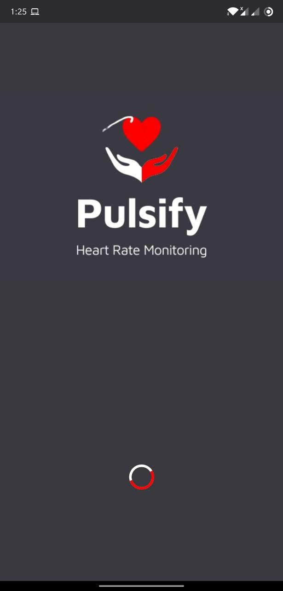
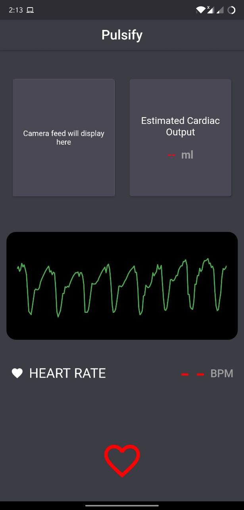
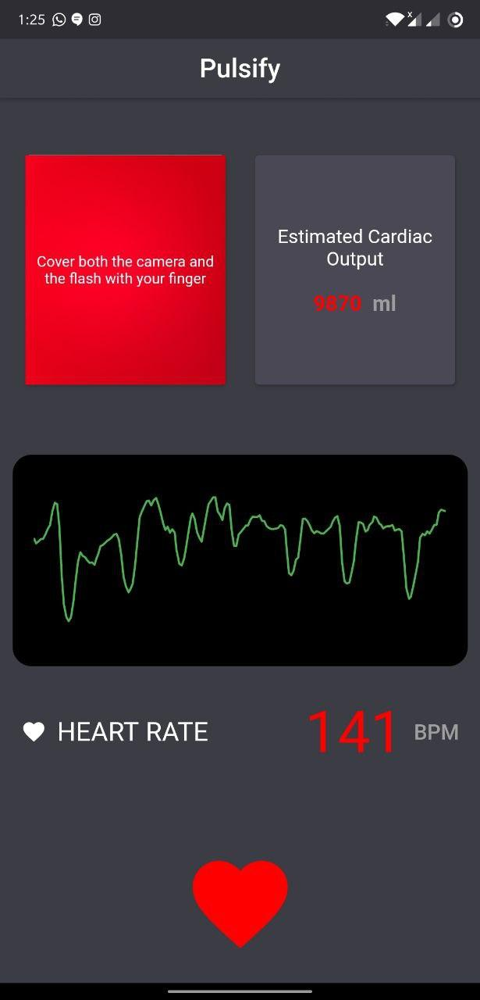

<h1 align="center">Pulsify</h1>

  <b>
Heart Rate Monitoring App</b> 
  This app calculates heart beats using a  technique called photoplethysmography.
Photoplethysmogram (PPG) is an optically obtained plethysmogram that can be used to detect blood volume changes in the microvascular bed of tissue.
Shining a light into a blood irrigated tissue, we can measure the variability of reflected light and extract the variation of blood flow. As we all know, the blood flow is dependent on the heart rate, so we can calculate the heart rate using the blood flow variation.

 
 
      

 
 

  

      

  

